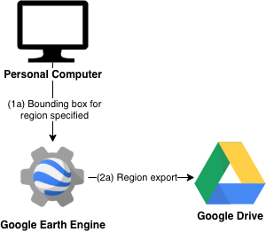
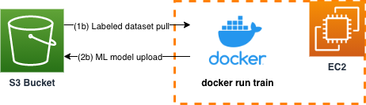
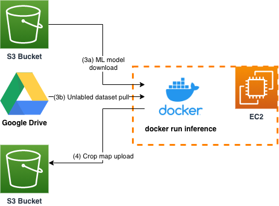
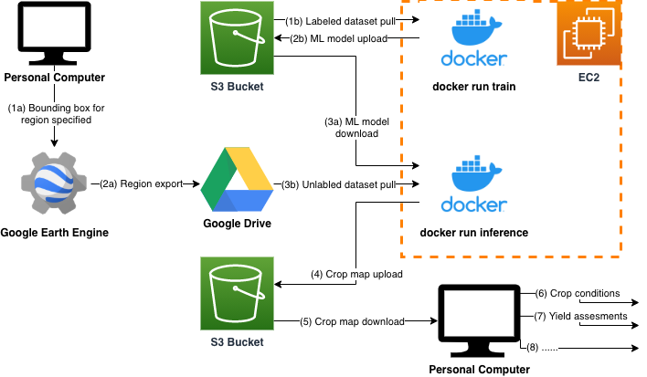

# Crop Map Generation
[](https://github.com/nasaharvest/crop-mask/actions)
[](https://codecov.io/gh/nasaharvest/crop-mask)

This repository contains code and data to generate annual and in-season crop masks. Two models are trained - a multi-headed pixel wise classifier to classify pixels as containing crop or not, and a multi-spectral satellite image forecaster which forecasts a 12 month timeseries given a partial input:


These can be used to create annual and in season crop maps. 

## Contents
- [1. Setting up a local environment](#1-setting-up-a-local-environment)
- [2. Adding unlabeled data](#2-adding-unlabeled-data)
- [3. Adding labeled data](#3-adding-labeled-data)
- [4. Generating a crop map (with docker)](#4-generating-a-crop-map--with-docker-)
  * [Setup environment variables](#setup-environment-variables)
  * [Training a new model to generate a crop map](#training-a-new-model-to-generate-a-crop-map)
  * [Generating a crop map with an existing model](#generating-a-crop-map-with-an-existing-model)
  * [Monitoring training and inference](#monitoring-training-and-inference)
  * [Diagram of the process](#diagram-of-the-process)
  * [Building the docker image locally](#building-the-docker-image-locally)
- [5. Tests](#5-tests)
- [6. Previously generated crop maps](#6-previously-generated-crop-maps)
- [7. Acknowledgments](#7-acknowledgments)
- [8. Reference](#8-reference)

## 1. Setting up a local environment
1. Ensure you have [anaconda](https://www.anaconda.com/download/#macos) installed and run:
    ```bash
    conda env create -f environment.yml   # Creates environment
    conda activate landcover-mapping      # Activates environment
    ```
2. [OPTIONAL] When adding new labeled or unlabeled data, Google Earth Engine is used to export Satellite data. To authenticate Earth Engine run:
    ```bash
    earthengine authenticate                # Authenticates Earth Engine              
    python -c "import ee; ee.Initialize()"  # Will raise error if not setup 
    ```
3. [OPTIONAL] To access existing data (ie. features, models), obtain valid AWS credentials, ensure you have [AWS cli](https://docs.aws.amazon.com/cli/latest/userguide/install-cliv2.html) installed and run:
    ```bash
    aws configure   # Sets up the AWS profile locally
    ```
    Then download the data by running one of the following:
    ```bash
    dvc pull                                  # All data (will take long time)
    dvc pull data/features data/models        # For retraining or inference
    dvc pull data/processed                   # For labeled data analysis
    ```
 

## 2. Adding data
### 2a. Adding unlabeled data
**Purpose:** 
Unlabeled data is a set of satellite images without a crop/non-crop label. Unlabeled data is used to make predictions.

**Steps to add unlabeled data:**
1. Ensure local environment is set up.
2. Open the [dataset_unlabeled.py](data/datasets_unlabeled.py) file and add a new `UnlabeledDataset` object into the `unlabeled_datasets` list and specify the required parameters (ie bounding box for region).
3. To begin exporting satellite data from Google Earth Engine to your Google Drive run (from scripts directory):
    ```bash
    python export_for_unlabeled.py --dataset_name <YOUR DATASET NAME>
    ```


Running exports can be viewed (and individually cancelled) in the `Tabs` bar on the [Earth Engine Code Editor](https://code.earthengine.google.com/).

### 2b. Adding labeled data
**Purpose:** 
Labeled data is a set of satellite images with a crop/non-crop label. Labeled data is used to train and evaluate the machine learning model.

Since the labeled data is directly tied to the machine learning model, it is kept track of using [dvc](https://dvc.org/doc) inside the [data](data) directory. The [data](data) directory contains *.dvc files which point to the version and location of the data in remote storage (in this case an AWS S3 Bucket).

**Steps to add new labeled data:**
1. Ensure local environment is set up and all existing data is downloaded.
2. Add the shape file for new labels into [data/raw](data/raw)
3. In [dataset_labeled.py](data/datasets_labeled.py) add a new `LabeledDataset` object into the `labeled_datasets` list and specify the required parameters.
4. To process the labels into a standard format and begin exporting satellite data from Google Earth Engine run (from scripts directory):
    ```bash
    python export_for_labeled.py
    ``` 
5. Google Earth Engine will automatically export satellite images to Google Drive.
6. Once the satellite data has been exported, download it from Google Drive into [data/raw](data/raw).
7. To combine the labels and the satellite images into a machine learning suitable dataset run (from scripts directory):
    ```bash
    python engineer.py
    ```
8. Run `dvc commit` and `dvc push` to upload the new labeled data to remote storage.


## 3. Training and inference
### 3a. Training locally
You must have the specified datasets in `data/features`
```bash
python model.py --datasets "geowiki_landcover_2017,Kenya" --model_name "Kenya"
```
### 3b. Training with docker
You must have [docker](https://docs.aws.amazon.com/AmazonECS/latest/developerguide/docker-basics.html) and awscli installed on the machine.

**Step 1:** Specify the following arguments:
```bash
export DOCKER_BUILDKIT=1
export AWS_CREDENTIALS=$HOME/.aws/credentials
export CLEARML_CREDENTIALS=$HOME/clearml.conf

export DATASETS="geowiki_landcover_2017,Kenya"  # Example datasets for which features exist
export MODEL_NAME="Kenya"                       # Example new model name
export MODELS_DVC_DIR="$HOME/crop-mask/data"    # Directory of the models.dvc file
```

**Step 2:** Begin training:
```bash
docker run \
  -v $AWS_CREDENTIALS:/root/.aws/credentials \
  -v $CLEARML_CREDENTIALS:/root/clearml.conf \
  --mount type=bind,source=$MODELS_DVC_DIR,target=/vol \
  -it ivanzvonkov/cropmask conda run -n landcover-mapping python model.py \
  --datasets $DATASETS \
  --model_name $MODEL_NAME
```
This command does the following:
1. Pulls in the specified labeled dataset to train a model 
2. Pushes trained model to remote storage and outputs the models.dvc file to `$MODELS_DVC_DIR`, this file needs to be git committed inorder to share the trained model with collaborators 


## 3c. Generating a crop map (with docker)

You must have [docker](https://docs.aws.amazon.com/AmazonECS/latest/developerguide/docker-basics.html) and awscli installed on the machine. If doing inference and using the `--gpus all` flag the host machine must have accessible GPU drivers and [NVIDIA Docker](https://github.com/NVIDIA/nvidia-docker) is setup.


**Step 1:** Specify the environment variables:
```bash
# Example
export DOCKER_BUILDKIT=1
export AWS_CREDENTIALS=$HOME/.aws/credentials
export CLEARML_CREDENTIALS=$HOME/clearml.conf
export RCLONE_CREDENTIALS=$HOME/.config/rclone/rclone.conf

export MODEL_NAME="Kenya"                               # Existing model to be used for inference
export GDRIVE_DIR="remote2:earth_engine_region_rwanda"  # Location of input tif files
export VOLUME="/data"                                   # Directory on the host with a lot of space
```

If using an EC2 instance it is recommended to [mount an EBS volume](https://docs.aws.amazon.com/AWSEC2/latest/UserGuide/ebs-using-volumes.html) and use its path for `VOLUME`.

**Step 2:** Begin inference:
```bash
docker run --gpus all \
  -v $CLEARML_CREDENTIALS:/root/clearml.conf \
  -v $RCLONE_CREDENTIALS:/root/.config/rclone/rclone.conf \
  --mount type=bind,source=$VOLUME,target=/vol \
  -it ivanzvonkov/cropmask conda run -n landcover-mapping python predict.py \
  --gdrive_path_to_tif_files $GDRIVE_DIR \
  --local_path_to_tif_files /vol/input \
  --split_tif_files true \
  --model_name $MODEL_NAME \
  --predict_dir /vol/predict
```

This command does the following:
1. Pulls in the satellite images in Google Drive and splits them so they are ready for inference
2. Runs inference on each of the split files and outputs a crop map to remote storage.

**Note**: The ML model is packaged into the docker image at build time not during this command.



### 3d. Monitoring
ClearML is used for monitoring training and inference during each docker run. You'll need a ClearML account and access to the ClearML workspace (contact izvonkov@umd.edu)

### 3e. Diagram of the process 


### 3f. Building the docker image locally
```bash
export DOCKER_BUILDKIT=1
export AWS_CREDENTIALS=$HOME/.aws/credentials
docker build -t ivanzvonkov/cropmask --secret id=aws,src=$AWS_CREDENTIALS .
```

## 4. Tests
The following tests can be run against the pipeline:

```bash
flake8 --max-line-length 100 src data scripts test # code formatting
mypy src data scripts  # type checking
python -m unittest # unit tests 

# Integration tests
cd test
python -m unittest integration_test_labeled.py
python -m unittest integration_test_predict.py
```

## 5. Previously generated crop maps
Google Earth Engine:
* [Kenya (post season)](https://code.earthengine.google.com/ea3613a3a45badfd01ce2ec914dfe1ef)
* [Busia (in season)](https://code.earthengine.google.com/f567cccc28dad7a25e088d56dabfbd4c)

Zenodo
- [Kenya (post season) and Busia (in season)](https://doi.org/10.5281/zenodo.4271143).

## 6. Acknowledgments
This model requires data from [Plant Village](https://plantvillage.psu.edu/) and [One Acre Fund](https://oneacrefund.org/). We thank those organizations for making these datasets available to us - please contact them if you are interested in accessing the data.

## 7. Reference

If you find this code useful, please cite the following paper:

Gabriel Tseng, Hannah Kerner, Catherine Nakalembe and Inbal Becker-Reshef. 2020. Annual and in-season mapping of cropland at field scale with sparse labels. Tackling Climate Change with Machine Learning workshop at NeurIPS ’20: December 11th, 2020
