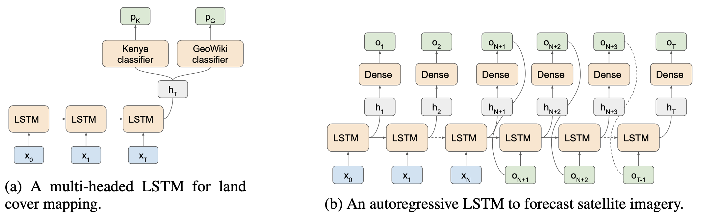

# Crop Map Generation

[](https://github.com/nasaharvest/crop-mask/actions/workflows/test.yml) [](https://github.com/nasaharvest/crop-mask/actions/workflows/deploy.yml)

End-to-end workflow for generating high resolution cropland maps.

## Contents
-   [Creating a crop map](#creating-a-crop-map)
-   [Training a new model](#training-a-new-model)
-   [Setting up a local environment](#setting-up-a-local-environment)
-   [Adding new labeled data](#adding-new-labeled-data)
-   [Tests](#tests)
-   [Previously generated crop maps](#previously-generated-crop-maps)
-   [Acknowledgments](#acknowledgments)
-   [Reference](#reference)
## Creating a crop map
To create a crop map run the following colab notebook: 
[](https://colab.research.google.com/github/nasaharvest/openmapflow/blob/main/openmapflow/notebooks/create_map.ipynb)


## Training a new model
To train a new model run the following colab notebook (or use it as a guide):
[](https://colab.research.google.com/github/nasaharvest/crop-mask/blob/master/notebooks/train.ipynb)

Two models are trained - a multi-headed pixel wise classifier to classify pixels as containing crop or not, and a multi-spectral satellite image forecaster which forecasts a 12 month timeseries given a partial input:



## Adding new labeled data
[](https://colab.research.google.com/github/nasaharvest/openmapflow/blob/main/openmapflow/notebooks/new_data.ipynb)
To add new labeled data follow the [OpenMapFlow documentation](https://github.com/nasaharvest/openmapflow#adding-data-) OR run the linked colab notebook. 


## Setting up a local environment
Ensure you have [anaconda](https://www.anaconda.com/download/#macos) installed.
#### 1. For development 
Ensure you have [gcloud](https://cloud.google.com/sdk/docs/install) installed.
```bash
python -m venv venv                         # Create environment  
source venv/bin/activate                    # Activate environment
pip install -r requirements.txt             # Install dependencies
gcloud auth application-default login       # Authenticates with Google Cloud
```

#### 2. For shapefile notebook
```bash
pip install cartopy jupyter geopandas
jupyter notebook
```

## Tests

The following tests can be run against the pipeline:

```bash
flake8 . # code formatting
mypy .  # type checking
python -m unittest # unit tests

# Integration tests
python -m unittest test/integration_test_model_bbox.py
python -m unittest test/integration_test_model_evaluation.py
```

## Steps to resolve module related issues on a Windows environment

```bash
I]Steps to resolve the issue related with 'fiona' and 'geopandas' module

pip uninstall geopandas  #if the package is already installed in the environment
pip install pipwin
pipwin install gdal
pipwin install fiona
pip install geopandas


II]Steps to resolve the issue related with 'netcdf' module

pip uninstall netcdf4
pip install netcdf4


III]Steps to resolve the warning encountered with the 'pyproj' module
mamba remove pyproj or pip uninstall pyproj
pip install pyproj

```

## Previously generated crop maps

Google Earth Engine:

-   [Kenya (post season)](https://code.earthengine.google.com/ea3613a3a45badfd01ce2ec914dfe1ef)
-   [Busia (in season)](https://code.earthengine.google.com/f567cccc28dad7a25e088d56dabfbd4c)

Zenodo

-   [Kenya (post season) and Busia (in season)](https://doi.org/10.5281/zenodo.4271143).

## Reference

If you find this code useful, please cite the following paper:

Gabriel Tseng, Hannah Kerner, Catherine Nakalembe and Inbal Becker-Reshef. 2020. Annual and in-season mapping of cropland at field scale with sparse labels. Tackling Climate Change with Machine Learning workshop at NeurIPS ’20: December 11th, 2020
