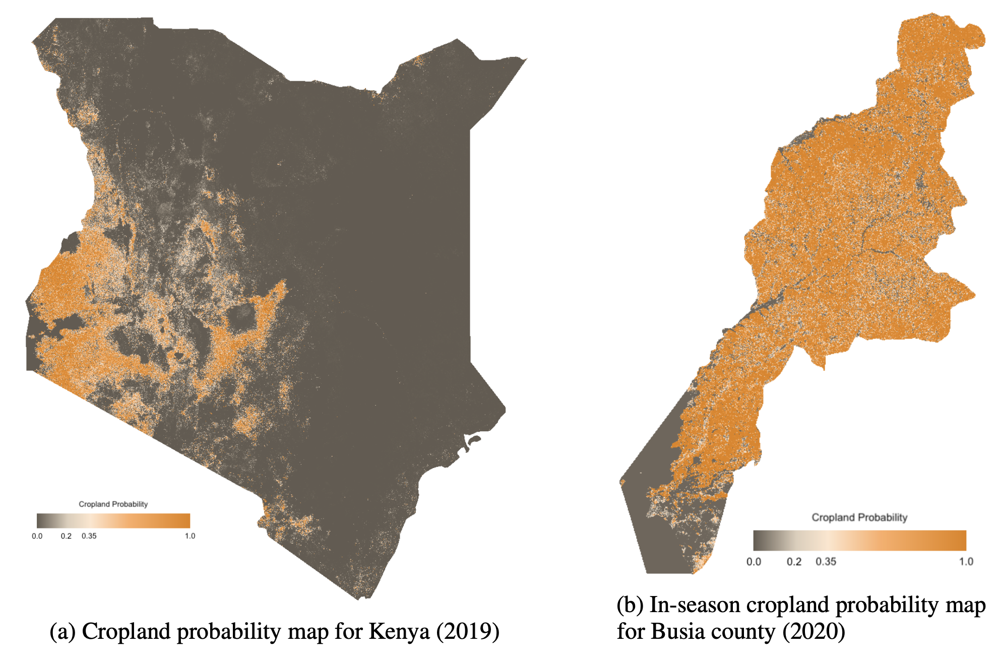

# Kenya crop mapping
Annual and in-season mapping of cropland in Kenya

## Introduction
This repository contains code and data to generate an annual and in-season crop mask for Kenya. Two models are trained - a multi-headed pixel wise classifier to classify pixels as containing crop or not, and a multi-spectral satellite image forecaster which forecasts a 12 month timeseries given a partial input:


These can be used to create annual and in season crop maps. This repository contains the code to do this for Kenya, and Busia county in Kenya:



These maps are available on Google Earth Engine:

* [Kenya (post season)](https://code.earthengine.google.com/ea3613a3a45badfd01ce2ec914dfe1ef)
* [Busia (in season)](https://code.earthengine.google.com/f567cccc28dad7a25e088d56dabfbd4c)

In addition, they are available on [Zenodo](https://doi.org/10.5281/zenodo.4271143).

This model requires data from [Plant Village](https://plantvillage.psu.edu/) and [One Acre Fund](https://oneacrefund.org/). We thank those organizations for making these datasets available to us - please contact them if you are interested in accessing the data.

## Pipeline

The main entrypoints into the pipeline are the [scripts](scripts). Specifically:

* [scripts/export.py](scripts/export.py) exports data (locally, or to Google Drive - see below)
* [scripts/process.py](scripts/process.py) processes the raw data
* [scripts/engineer.py](scripts/engineer.py) combines the earth observation data with the labels to create (x, y) training data
* [scripts/models.py](scripts/model.py) trains the models
* [scripts/predict.py](scripts/predict.py) takes a trained model and runs it on an area

The [split_tiff.py](scripts/split_tiff.py) script is useful to break large exports from Google Earth Engine, which may
be too large to fit into memory.

## Setup

[Anaconda](https://www.anaconda.com/download/#macos) running python 3.6 is used as the package manager. To get set up
with an environment, install Anaconda from the link above, and (from this directory) run

```bash
conda env create -f environment.yml
```
This will create an environment named `landcover-mapping` with all the necessary packages to run the code. To
activate this environment, run

```bash
conda activate landcover-mapping
```

If you are using a GPU, `environment.gpu.yml` additionally installs `cudatoolkit` so that pytorch can use it too.

#### Earth Engine

Earth engine is used to export data. To use it, once the conda environment has been activated, run

```bash
earthengine authenticate
```

and follow the instructions. To test that everything has worked, run

```bash
python -c "import ee; ee.Initialize()"
```

Note that Earth Engine exports files to Google Drive by default (to the same google account used sign up to Earth Engine).

Running exports can be viewed (and individually cancelled) in the `Tabs` bar on the [Earth Engine Code Editor](https://code.earthengine.google.com/).

Exports from Google Drive should be saved in [`data/raw`](data/raw).

#### Tests

The following tests can be run against the pipeline:

```bash
black .  # code formatting
mypy src  # type checking
```

## Reference

If you find this code useful, please cite the following paper:

Gabriel Tseng, Hannah Kerner, Catherine Nakalembe and Inbal Becker-Reshef. 2020. Annual and in-season mapping of cropland at field scale with sparse labels. Tackling Climate Change with Machine Learning workshop at NeurIPS ’20: December 11th, 2020

The hand labelled dataset used for training, and the crop maps, can be found at [https://doi.org/10.5281/zenodo.4271143](https://doi.org/10.5281/zenodo.4271143)
