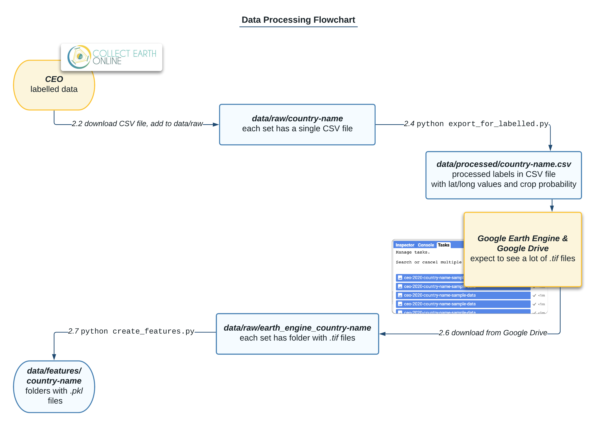

# Crop Map Generation

[](https://github.com/nasaharvest/crop-mask/actions)
[](https://codecov.io/gh/nasaharvest/crop-mask)

This repository contains code and data to generate annual and in-season crop masks. Two models are trained - a multi-headed pixel wise classifier to classify pixels as containing crop or not, and a multi-spectral satellite image forecaster which forecasts a 12 month timeseries given a partial input:


These can be used to create annual and in season crop maps.

## Contents

-   [1. Setting up a local environment](#1-setting-up-a-local-environment)
-   [2. Training a new model](#2-training-a-new-model)
-   [3. Running inference locally](#3-running-inference-locally)
-   [4. Running inference at scale (on GCP)](#4-running-inference-at-scale--on-gcp-)
-   [5. Tests](#5-tests)
-   [6. Previously generated crop maps](#6-previously-generated-crop-maps)
-   [7. Acknowledgments](#7-acknowledgments)
-   [8. Reference](#8-reference)

## 1. Setting up a local environment

1. Ensure you have [anaconda](https://www.anaconda.com/download/#macos) installed and run:
    ```bash
    conda config --set channel_priority true # Ensures conda will install environment
    conda env create -f environment-dev.yml   # Creates environment
    conda activate landcover-mapping      # Activates environment
    ```
2. [OPTIONAL] When adding new labeled data, Google Earth Engine is used to export Satellite data. To authenticate Earth Engine run:
    ```bash
    earthengine authenticate                # Authenticates Earth Engine
    python -c "import ee; ee.Initialize()"  # Will raise error if not setup
    ```
3. [OPTIONAL] To access existing data (ie. features, models), ensure you have [gcloud](https://cloud.google.com/sdk/docs/install) CLI installed and run:

    ```bash
    gcloud auth application-default login     # Authenticates gcloud
    dvc pull                                  # All data (will take long time)
    dvc pull data/features data/models        # For retraining or inference
    dvc pull data/processed                   # For labeled data analysis
    ```

    If you get an "invalid grant" error, you may need to run:

    ```bash
    gcloud auth application-default login
    ```

4. [OPTIONAL] Weights and Biases is used for logging model training, to train and view logs run:
    ```bash
    wandb login
    ```

## 2. Adding new labeled data

1. Ensure local environment is set up and all existing data is downloaded.
2. Add the shape file for new labels into [data/raw](data/raw)
3. In [dataset_labeled.py](src/datasets_labeled.py) add a new `LabeledDataset` object into the `labeled_datasets` list and specify the required parameters.
4. To create ML ready features run:

    ```bash
    python scripts/create_features
    ```

5. Run `dvc commit` and `dvc push` to upload the new labeled data to remote storage.



## 2. Training a new model

Add a new entry to [data/models.json](data/models.json), for example:

```json
{
    "model_name": "Ethiopia_Tigray_2021",
    "min_lon": 36.45,
    "max_lon": 40.00,
    "min_lat": 12.25,
    "max_lat": 14.895,
    "eval_datasets": ["Ethiopia_Tigray_2021"],
    "train_datasets": ["geowiki_landcover_2017" "Ethiopia"]
}
```

Then to train and evaluate the model run:

```python
python scripts/models_train_and_evaluate.py
```

**Json entry keys**
- `train_datasets` which datasets to train on
- `eval_datasets` which datasets to evaluate on
- `min/max_lat/lon` tells the model which items to consider in the local and global head

Any other valid model parameter can be added to this entry.

## 3. Running inference locally

**Prerequisite: Getting data for inference:**

1. Ensure local environment is set up.
2. Specify the destination folder and bounding box in scripts/export_region.py and run
    ```bash
    python scripts/export_region.py
    ```
3. Google Earth Engine will automatically export satellite images to Google Drive.
4. Once the satellite data has been exported, download it from Google Drive into [data/raw](data/raw).

**Actual inference**

```bash
python predict.py --model_name "Kenya" --local_path_to_tif_files "../data/raw/<dataset name>
```

## 4. Running inference at scale (on GCP)

**Deploying**

1. Ensure you have [gcloud](https://cloud.google.com/sdk/docs/install) CLI installed and authenticated.
2. Ensure you have a secret in GCP titled `GOOGLE_APPLICATION_CREDENTIALS`; this will allow Google Earth Engine to be authenticated.
3. Run the following to deploy the project into Google Cloud:

```bash
gsutil mb gs://crop-mask-earthengine
gsutil mb gs://crop-mask-preds
sh deploy_ee_functions.sh
sh deploy_inference.sh
```

**Checking which models are available**
https://crop-mask-management-api-grxg7bzh2a-uc.a.run.app/models

**Actual inference at scale**

```bash

curl -X POST http://us-central1-bsos-geog-harvest1.cloudfunctions.net/export-region \
    -o - \
    -H "Content-Type:application/json" \
    -d @gcp/requests/<example>.json
```

**Tracking progress**

```bash
# Earth Engine progress
curl https://us-central1-bsos-geog-harvest1.cloudfunctions.net/ee-status?additional=FAILED,COMPLETED | python -mjson.tool

# Amount of files exported
gsutil du gs://crop-mask-earthengine/<model name>/<dataset> | wc -l

# Amount of files predicted
gsutil du gs://crop-mask-preds/<model name>/<dataset> | wc -l
```

**Addressing missed predictions (Not automated)**
When processing 100,000 tif files it is highly likely that crop-mask inference may fail on some files due to issues with not scaling up fast enough. Run the cells in [notebooks/fix-preds-on-gcloud.ipynb](notebooks/fix-preds-on-gcloud.ipynb) to address this problem.

**Putting it all together (Not automated)**
Once an inference run is complete the result is several small `.nc` files. These need to be merged into a single `.tif` file. Currently this operation is not automated and requires the user to:

```bash
export MODEL="Rwanda"
export DATASET="Rwanda_v2"
export START_DATE=2019-04-01
export END_DATE=2020-04-01

# Download appropriate folder
gsutil -m cp -n -r gs://crop-mask-preds/$MODEL/$DATASET/ .

# Run gdal merge script
cd crop-mask
python gcp/merger/main.py --p ../$DATASET

# [OPTIONAL] Upload COG tif output to Google Cloud Storage
gsutil cp ../$DATASET/tifs/final.tif gs://crop-mask-preds-merged/$DATASET

# [OPTIONAL] Upload COG to Google Earth Engine
earthengine upload image --asset_id users/izvonkov/$DATASET -ts $START_DATE -te $END_DATE gs://crop-mask-preds-merged/$DATASET
```

## 5. Tests

The following tests can be run against the pipeline:

```bash
flake8 --max-line-length 100 src data scripts test # code formatting
mypy src data scripts  # type checking
python -m unittest # unit tests

# Integration tests
cd test
python -m unittest integration_test_labeled.py
python -m unittest integration_test_predict.py
```

## 6. Previously generated crop maps

Google Earth Engine:

-   [Kenya (post season)](https://code.earthengine.google.com/ea3613a3a45badfd01ce2ec914dfe1ef)
-   [Busia (in season)](https://code.earthengine.google.com/f567cccc28dad7a25e088d56dabfbd4c)

Zenodo

-   [Kenya (post season) and Busia (in season)](https://doi.org/10.5281/zenodo.4271143).

## 7. Acknowledgments

This model requires data from [Plant Village](https://plantvillage.psu.edu/) and [One Acre Fund](https://oneacrefund.org/). We thank those organizations for making these datasets available to us - please contact them if you are interested in accessing the data.

## 8. Reference

If you find this code useful, please cite the following paper:

Gabriel Tseng, Hannah Kerner, Catherine Nakalembe and Inbal Becker-Reshef. 2020. Annual and in-season mapping of cropland at field scale with sparse labels. Tackling Climate Change with Machine Learning workshop at NeurIPS ’20: December 11th, 2020
