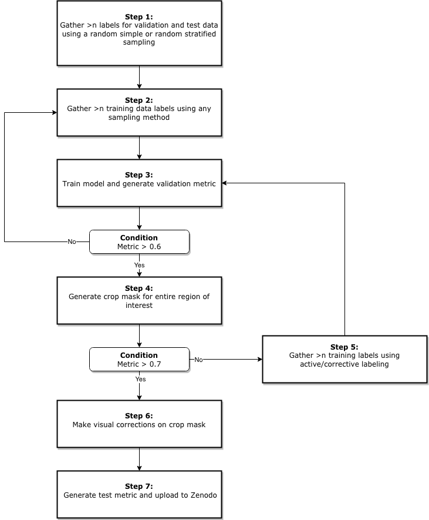

# Crop Map Generation Status

[Step 0]: https://progress-bar.dev/0/?scale=9&suffix=/7&width=400
[Step 1]: https://progress-bar.dev/1/?scale=9&suffix=/7&width=400
[Step 2]: https://progress-bar.dev/2/?scale=9&suffix=/7&width=400
[Step 3]: https://progress-bar.dev/3/?scale=9&suffix=/7&width=400
[Step 4]: https://progress-bar.dev/4/?scale=9&suffix=/7&width=400
[Step 5]: https://progress-bar.dev/5/?scale=9&suffix=/7&width=400
[Step 6]: https://progress-bar.dev/6/?scale=9&suffix=/7&width=400
[Step 7]: https://progress-bar.dev/7/?scale=9&suffix=/7&width=400

[Kenya Zenodo]: https://zenodo.org/record/4271144#.YK07oJNKhTZ
[Togo Zenodo]: https://zenodo.org/record/3836629#.YK08FJNKhTY

|Country            |Season         |Steps Complete |Link   |Notes  |
|---                |:---:          |:---:          |:---:  |:---:  |
|Kenya              |2019/20        |![Step 7]     |[Kenya Zenodo]   |  |
|Togo               |2019/20        |![Step 7]     |[Togo Zenodo]   |   |
|Mali (lower USAID) |2020/21        |![Step 0]      |       | Gathering labels on CEO      |
|Mali (upper USAID) |2020/21        |![Step 0]      |       |Gathering labels on CEO       |
|Rwanda             |2019/20        |![Step 1]      |       |       |
|Uganda             |2020/21        |![Step 1]      |       |       |
|Uganda (Maize)     |2020/21        |![Step 0]      |       |       |

### Steps for generating crop map:

